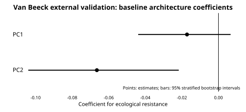
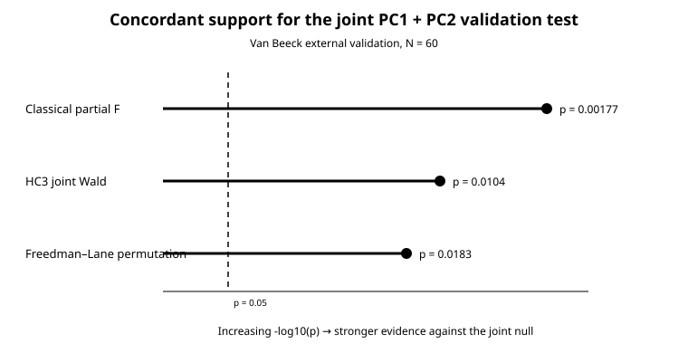
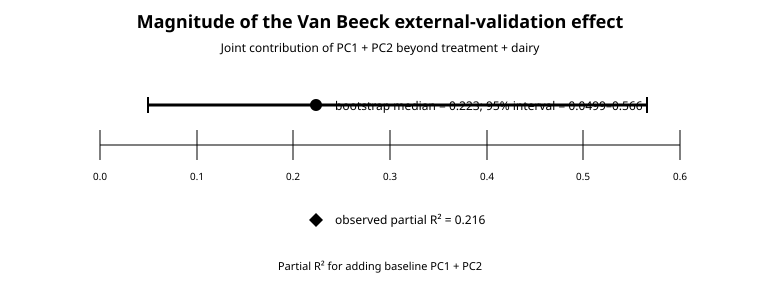

# MMER

**Mammary Metataxonomy Ecological Resistance**

MMER is a reproducible multi-cohort reanalysis framework for testing whether the **baseline ecological organization of the bovine mammary microbiome is associated with its subsequent ecological resistance**.

Ecological resistance is defined as:

`ecological_resistance = 1 - Bray-Curtis(baseline, follow-up)`

Higher values indicate greater compositional retention relative to the same biological unit's own baseline.

## Core scientific question

> **Does baseline multivariate mammary-community architecture contain information about how strongly that community resists subsequent ecological displacement, and does that phenomenon generalize across independent cohorts?**

MMER explicitly separates **discovery/development** from **external validation/generalization**.

## Current five-study evidence structure

| Role | Cohort | Platform | Primary unit / analysis | Frozen result |
|---|---|---|---|---|
| Discovery | Italy / Biscarini / PRJEB38332 | 16S | healthy mammary-quarter trajectories | contributes to significant pooled baseline-architecture signal |
| Discovery | Manitoba / Derakhshani | 16S | healthy mammary-quarter trajectories | contributes to significant pooled baseline-architecture signal |
| External validation | Porcellato / PRJEB35792 | 16S | 154 same-quarter Sampling1→Sampling2 trajectories | **strong positive validation** |
| External validation | Van Beeck / PRJEB63336 | 16S | 60 complete longitudinal milk trajectories | **positive validation with HC3, permutation and bootstrap support** |
| External generalization | Patangia | shotgun / Kraken2 family profiles | 24 cows with M0, M2, M4, M6 | **prespecified primary taxonomic test null** |

The current evidence therefore contains **two independent positive 16S validations** plus one informative shotgun taxonomic non-replication.

---

## Discovery — Italy + Manitoba

The frozen healthy discovery analysis contains **49 mammary-quarter trajectories from 14 cows**:

- Italy: 20 trajectories / 5 cows
- Manitoba: 29 trajectories / 9 cows

Baseline family composition is CLR transformed and centered within study before pooled PCA.

Primary model:

`ecological_resistance ~ z_PC1 + z_PC2 + study`

Cow-clustered CR2 inference:

- joint PC1 + PC2 HTZ F = **10.0**
- df = **2, 7.81**
- p = **0.00699**
- PC1 beta = **-0.0286**, p = 0.124
- PC2 beta = **+0.0622**, p = **0.00302**
- descriptive R² = **0.334**
- adjusted R² = **0.289**

**Discovery interpretation:** baseline multivariate community architecture is associated with subsequent ecological resistance across the pooled Italy + Manitoba healthy-quarter analysis.

---

## External validation — Porcellato

Porcellato is an independent same-quarter longitudinal 16S cohort.

Locked primary cohort:

- **154 trajectories**
- Farm A: 93
- Farm K: 61
- 50 baseline families retained for independent PCA

Primary model:

`ecological_resistance ~ z_PC1 + z_PC2 + farm`

Primary result:

- PC1 beta = **-0.0892**, p < 0.001
- PC2 beta = **+0.0636**, p = **0.0106**
- farm K beta = **+0.3061**, p < 0.001
- joint PC1 + PC2 HTZ F = **9.49**
- df = **2, 23.5**
- p < **0.001**
- descriptive R² = **0.410**

The result remains positive under stricter post-taxonomy assigned-read thresholds.

**Porcellato interpretation:** strong independent phenomenon-level replication of baseline ecological architecture predicting subsequent ecological resistance.

---

## External validation — Van Beeck

Van Beeck et al. sampled milk and teat-skin microbiota at three California dairies at baseline dry-off, 7 days later, and 55–75 DIM in the next lactation. MMER uses the locked complete longitudinal **milk trajectories only**.

Locked Van Beeck external cohort:

- **60 complete trajectories / 180 samples**
- low-SCC untreated control: 14
- high-SCC untreated control: 12
- cephapirin benzathine (CB): 18
- ceftiofur hydrochloride (CH): 16

The frozen primary phenotype is:

`overall_resistance = mean[1 - Bray(Baseline,7Days), 1 - Bray(Baseline,55-75DIM)]`

Baseline family relative abundances are prevalence-filtered, zero-replaced using half the smallest positive baseline relative abundance, CLR transformed, centered within dairy, and subjected to an **independent Van Beeck PCA**.

Primary model:

`overall_resistance ~ z_PC1 + z_PC2 + treatment + dairy`

The external-validation target is the **joint PC1 + PC2 term**. Treatment and dairy are design-adjustment covariates; subgroup and interaction analyses are not part of the canonical validation claim.

### Primary Van Beeck result

- N = **60**
- full-model R² = **0.316**
- adjusted R² = **0.224**
- partial R² for PC1 + PC2 = **0.216**
- classical F(2,52) = **7.18**, p = **0.00177**
- HC3 joint Wald χ²(2) = **9.13**, p = **0.0104**
- 9,999 Freedman–Lane permutation p = **0.0183**
- PC1 beta = **-0.0172**, HC3 p = 0.283
- PC2 beta = **-0.0665**, HC3 p = **0.0246**

### Bootstrap uncertainty

5,000 / 5,000 stratified complete-trajectory bootstrap replicates were valid.

- PC1 95% interval: **-0.0439 to +0.00665**
- PC2 95% interval: **-0.104 to -0.0217**
- PC2 negative in **99.6%** of bootstrap replicates
- partial-R² bootstrap median: **0.223**
- partial-R² percentile interval: **0.0499 to 0.566**

**Van Beeck interpretation:** baseline family-level community architecture significantly predicts subsequent ecological resistance after adjustment for treatment and dairy, providing a second independent 16S external validation of the Italy + Manitoba phenomenon.

Because Van Beeck PCA is fitted independently, its PC signs and loading patterns are **cohort-specific**. This is phenomenon-level replication, not exact discovery-axis transport.

### Van Beeck workflow

- [`docs/vanbeeck_external_validation_workflow_2026-08-16.md`](docs/vanbeeck_external_validation_workflow_2026-08-16.md) — full background, rationale, conceptual novelty, methods, results, discussion and figure plan
- [`scripts/26j_vanbeeck_external_validation_only.R`](scripts/26j_vanbeeck_external_validation_only.R) — canonical all-60 external-validation analysis
- [`scripts/26k_vanbeeck_external_validation_plots.R`](scripts/26k_vanbeeck_external_validation_plots.R) — publication-ready plotting workflow

Immediate vector summaries:

---

## External generalization — Patangia shotgun cohort

Patangia contains **24 cows with complete M0, M2, M4, and M6 samples**. Family-level taxonomic profiles were generated from shotgun reads with Kraken2.

Prespecified primary M0→M2 result:

- mean ecological resistance = **0.441**
- PC1 beta = **+0.0334**
- PC2 beta = **-0.0252**
- R² = **0.0275**
- standard joint p ≈ **0.746**
- HC3 joint p ≈ **0.784**

**Patangia interpretation:** the primary shotgun taxonomic architecture test does not validate the discovery phenomenon at M0→M2.

Later-window M2→M6 evidence remains explicitly exploratory and does not replace the primary null result.

The current data do **not** justify claiming a 16S-versus-shotgun biological platform effect because platform, cohort context, sample size, biological window, host/background DNA and feature representation are confounded.

---

## Current synthesis

The current evidence supports:

> **Baseline mammary microbial community architecture is associated with subsequent ecological resistance in the pooled Italy + Manitoba discovery analysis and independently validates in both Porcellato and Van Beeck 16S cohorts. The prespecified Patangia shotgun taxonomic analysis is null, showing that the phenomenon is not universally detectable across every cohort or data modality.**

This does **not** establish:

- a universal fixed PC axis;
- universal directionality of independently fitted PCs;
- a single causal family-level biomarker;
- exact loading transport across cohorts;
- a sequencing-platform-specific causal effect;
- guaranteed prediction in every biological window;
- causality of baseline ecological architecture.

---

## Why MMER is different from the original Italy and Manitoba questions

The source studies primarily asked how mammary microbial communities changed across interventions, the dry period and sampling times. MMER asks a different ecological question:

> **Why do individual mammary ecological systems differ in the magnitude of their longitudinal displacement, and is that heterogeneity associated with their baseline multivariate ecological state?**

Key conceptual changes include:

1. **Average treatment/time effects → individual response heterogeneity.**
2. **Longitudinal samples → a unit-level ecological-resistance phenotype.**
3. **Baseline diversity summaries → multivariate family-level architecture.**
4. **Residual between-unit variability → the primary biological signal.**
5. **Timepoint comparison → initial-state dependence.**
6. **Within-study inference → discovery versus external validation.**
7. **Single-study taxonomy → cross-cohort harmonized ecological representation.**
8. **Taxon-by-taxon interpretation → multivariate ecological-state interpretation.**
9. **Pooled cohort identity → within-study/dairy centering before ordination where appropriate.**
10. **Post hoc reproducibility → frozen primary estimands and explicit non-replication reporting.**

See [`docs/MMER_source_papers_critical_comparison.md`](docs/MMER_source_papers_critical_comparison.md) and the Van Beeck workflow document for the full rationale.

---

## Core aims

1. **Quantify mammary ecological resistance** at the longitudinal biological-unit level.
2. **Determine whether baseline ecological architecture predicts subsequent resistance**, while separating the phenomenon from broad study/treatment context.
3. **Characterize the dimensions and generalizability of ecological resistance** across cohorts, biological contexts and sequencing modalities.

---

## Current evidence freeze

- [`docs/five_study_ecological_resistance_freeze_2026-08-16.md`](docs/five_study_ecological_resistance_freeze_2026-08-16.md) — **current five-study evidence freeze**
- [`docs/four_study_ecological_resistance_freeze_2026-08-16.md`](docs/four_study_ecological_resistance_freeze_2026-08-16.md) — historical snapshot before Van Beeck validation
- [`docs/frozen_primary_healthy_two_aims_2026-08-16.md`](docs/frozen_primary_healthy_two_aims_2026-08-16.md) — frozen Italy + Manitoba discovery analysis
- [`docs/external_generalization_status_2026-08-16.md`](docs/external_generalization_status_2026-08-16.md) — Porcellato and Patangia external analyses
- [`docs/vanbeeck_external_validation_workflow_2026-08-16.md`](docs/vanbeeck_external_validation_workflow_2026-08-16.md) — Van Beeck external-validation manuscript/workflow document

---

## Reproducibility guardrails

- Italy + Manitoba remain discovery/development cohorts.
- Porcellato N = 154 remains its primary external-validation cohort.
- Van Beeck N = 60 all-trajectory analysis remains its primary external-validation cohort.
- Van Beeck's primary outcome is overall baseline-relative resistance across the two post-baseline observations.
- Van Beeck treatment and dairy are adjustment covariates, not the primary scientific target.
- Van Beeck subgroup or treatment-interaction analyses cannot replace the all-60 primary test.
- Patangia M0→M2 remains the primary shotgun taxonomic test.
- Patangia M2→M6 remains exploratory.
- Use cow-clustered inference when multiple quarter trajectories arise from a cow.
- Do not use singleton-cluster CR2 when an endpoint model contains one independent observation per cow/trajectory.
- Do not interpret PCA loading families as individually causal biomarkers.
- Independent PCA supports phenomenon-level replication only.
- Exact cross-study axis transport requires harmonized features and projection of frozen discovery loadings.
- Do not infer a sequencing-platform effect from the current small set of cohorts.
- Do not promote secondary windows or subgroup analyses because they give smaller p-values.

## Status

**Italy + Manitoba discovery:** complete and frozen.

**Porcellato external 16S validation:** complete; strong positive replication.

**Van Beeck external 16S validation:** complete; positive replication with classical, HC3, permutation and bootstrap support.

**Patangia shotgun taxonomic external test:** complete; prespecified primary null.

**Current priority:** integrate the five-study evidence into publication-ready cross-study figures, Aim 1–3 results and discussion without changing frozen primary hypotheses.
